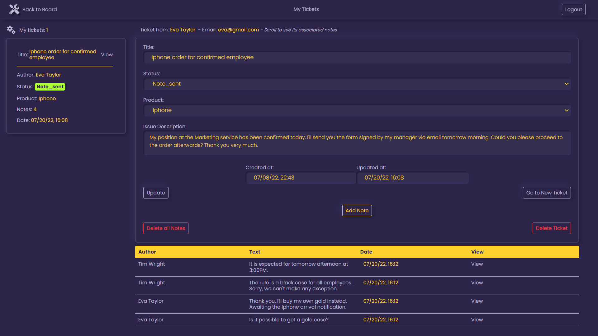

# Remix Support Desk!<!-- omit in toc -->



## Table of Content <!-- omit in toc -->

- [About](#about)
- [Features](#features)
- [NPM packages](#npm-packages)
- [Remix](#remix)
- [Development](#development)
- [Deployment](#deployment)
- [License](#license)

## About

Support Desk is a platform that can be used by the technical team and the employees of a company.

- On one side, IT administrators can supervise the daily support of employees equipment, receive tickets, send notes and manage employees profile.
- On the other side, employees can send tickets, receive and answer notes, manage their own profile

## Features

- App: **Remix + React + Node + ESLint + TypeScript + Vercel**
- Router: **React-router-dom V6**
- Authorizations: protected routes for IT administrators
- CRUD operations for tickets, notes and profiles

- Fully responsive: mobile and desktop devices friendly
- sticky navigation bar
- search component

## NPM packages

- Node.js and TypeScript ORM: **[Prisma Client](https://www.prisma.io/)**
- Database: **[MongoDB](https://www.mongodb.com/)**
- React-based design system **[Reach UI](https://reach.tech/)**: alert-dialog + dialog
- Password encryption: **[bcryptjs](https://github.com/dcodeIO/bcrypt.js#readme)**
- Icons: **[react-icons](https://react-icons.github.io/react-icons/)**
- Custom error messages: **[tiny-invariant](https://github.com/alexreardon/tiny-invariant#readme)**

## Remix

- [Remix Docs](https://remix.run/docs)

## Development

To run your Remix app locally, make sure your project's local dependencies are installed:

```sh
npm install
```

Afterwards, start the Remix development server like so:

```sh
npm run dev
```

Open up [http://localhost:3000](http://localhost:3000) and you should be ready to go!

If you're used to using the `vercel dev` command provided by [Vercel CLI](https://vercel.com/cli) instead, you can also use that, but it's not needed.

## Deployment

After having run the `create-remix` command and selected "Vercel" as a deployment target, you only need to [import your Git repository](https://vercel.com/new) into Vercel, and it will be deployed.

If you'd like to avoid using a Git repository, you can also deploy the directory by running [Vercel CLI](https://vercel.com/cli):

```sh
npm i -g vercel
vercel
```

It is generally recommended to use a Git repository, because future commits will then automatically be deployed by Vercel, through its [Git Integration](https://vercel.com/docs/concepts/git).

## License

MIT © Dominique Bello aka Catevika
